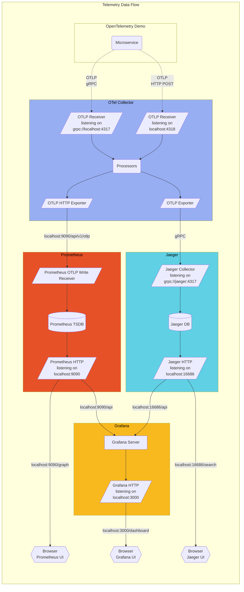

# Quick Start guide for OpenTelemetry

## Architecture Overview

Based on the [OpenTelemetry Demo Architecture](https://opentelemetry.io/docs/demo/architecture/).



## Visualization and Debugging Tools

| Tool | Purpose | URL/Port | Strengths |
|------|---------|----------|-----------|
| **TraceZ** | Debug interface for all signal types | `http://localhost:55679/debug/tracez` | Comprehensive view of traces, metrics, logs and events; excellent for debugging |
| **Jaeger** | Distributed tracing visualization | `http://localhost:16686` | Excellent trace visualization and analysis with query capabilities |
| **Prometheus** | Metrics collection and visualization | Typically `http://localhost:9090` | Time-series metrics visualization with powerful query language |
| **Grafana** | Multi-source dashboard creation | Typically `http://localhost:3000` | Custom dashboards combining multiple data sources |

## Transport Protocols and Data Formats

| Feature | gRPC/Protobuf | HTTP/JSON |
|---------|--------------|-----------|
| **Transport Protocol** | gRPC | HTTP |
| **Data Format** | Binary Protobuf | JSON |
| **Default Port** | 4317 | 4318 |
| **Endpoint Path Pattern** | N/A (service-based) | `/v1/{signal}` (e.g., `/v1/traces`) |
| **Performance** | Better performance (binary) | Slightly higher overhead |
| **Human Readability** | Not human-readable | Human-readable |
| **Tool Support** | `telemetrygen` (default) | `telemetrygen` (with `--use-http`) or curl |
| **Use Cases** | Production systems | Debugging, manual testing |

## Signal Types and Structure

| Signal Type | Root Element | Collection Element | Data Element | Endpoint |
|-------------|--------------|-------------------|--------------|----------|
| **Traces** | `resourceSpans` | `scopeSpans` | `spans` | `/v1/traces` |
| **Metrics** | `resourceMetrics` | `scopeMetrics` | `metrics` | `/v1/metrics` |
| **Logs** | `resourceLogs` | `scopeLogs` | `logRecords` | `/v1/logs` |
| **Events** | `resourceLogs` | `scopeLogs` | `logRecords` (with `event.name` attribute) | `/v1/logs` |

## Key Testing Tools

| Tool | Purpose | Transport | Example Usage |
|------|---------|-----------|---------------|
| **telemetrygen** | Generate test data for all signal types | gRPC (default) or HTTP | `telemetrygen traces --otlp-insecure --duration 5s` |
| **curl** | Manual testing with HTTP/JSON | HTTP only | `curl -X POST -H "Content-Type: application/json" -d @logs.json -i localhost:4318/v1/logs` |

## Hands-on Walkthrough

- to go beyond understanding the big picture elements of OpenTelemetry to unit testing basic capabilities, these resources are very helpful
  - GO based `telemetrygen` tool
    - [Quick Start guide](https://opentelemetry.io/docs/collector/quick-start/): installation instructions
    - [Using the tool](https://github.com/open-telemetry/opentelemetry-collector-contrib/blob/main/cmd/telemetrygen/README.md): provides basic requests for validating metrics, logs, and traces
  - [curl based JSON requests](https://github.com/open-telemetry/opentelemetry-proto/blob/main/examples/README.md): used to validate the non-gRPC endpoint

### Quickstart using TraceZ

**UI Endpoint URL:**  http://localhost:55679/debug/tracez

```bash
docker run \
  -p 127.0.0.1:4317:4317 \
  -p 127.0.0.1:4318:4318 \
  -p 127.0.0.1:55679:55679 \
  otel/opentelemetry-collector-contrib:0.121.0 \
  2>&1 | tee collector-output.txt # Optionally tee output for easier search later
```

#### Sample gRPC Requests - sent to port 4317

```bash
$GOBIN/telemetrygen traces --otlp-insecure --traces 3
```

```bash
$GOBIN/telemetrygen traces --otlp-insecure --duration 5s
```

```bash
$GOBIN/telemetrygen logs --otlp-insecure --duration 5s
```

```bash
$GOBIN/telemetrygen metrics --otlp-insecure --duration 5s
```

```bash
$GOBIN/telemetrygen traces --otlp-insecure \
  --traces 3 2>&1 | grep -E 'start|traces|stop'
```

#### Sample JSON requests: sent to port 4318

- Trace [trace.json](https://github.com/open-telemetry/opentelemetry-proto/blob/main/examples/trace.json)
- Metrics [metrics.json](https://github.com/open-telemetry/opentelemetry-proto/blob/main/examples/metrics.json)
- Logs [logs.json](https://github.com/open-telemetry/opentelemetry-proto/blob/main/examples/logs.json)
  - Events [events.json](https://github.com/open-telemetry/opentelemetry-proto/blob/main/examples/events.json)

```bash
curl -X POST -H "Content-Type: application/json" -d @json_trace.json -i localhost:4318/v1/traces
```

```bash
curl -X POST -H "Content-Type: application/json" -d @json_metrics.json -i localhost:4318/v1/metrics
```

```bash
curl -X POST -H "Content-Type: application/json" -d @json_logs.json -i localhost:4318/v1/logs
```

NOTE: the next sample request is broken, but still helpful from a learning perspective

```bash
curl -X POST -H "Content-Type: application/json" -d @json_events.json -i localhost:4318/v1/logs
```

### Using Jaeger for Tracing Visualization

**UI Endpoint URL:**  http://localhost:16686

```bash
docker run -v $(pwd)/jager-config.yaml:/etc/otelcol-contrib/config.yaml \
  -d --name jaeger \
  -e COLLECTOR_OTLP_ENABLED=true \
  -p 16686:16686 \
  -p 4317:4317 \
  -p 4318:4318 \
  jaegertracing/all-in-one:latest
```

#### jaeger-config.yaml

```yaml
receivers:
  otlp:
    protocols:
      grpc:
        endpoint: 0.0.0.0:4317
      http:
        endpoint: 0.0.0.0:4318

processors:
  batch:

exporters:
  jaeger:
    endpoint: "http://localhost:16686/api/traces"
    tls:
      insecure: true
  debug:
    verbosity: detailed

service:
  pipelines:
    traces:
      receivers: [otlp]
      processors: [batch]
      exporters: [jaeger, debug]
    metrics:
      receivers: [otlp]
      processors: [batch]
      exporters: [debug]
    logs:
      receivers: [otlp]
      processors: [batch]
      exporters: [debug]
```
